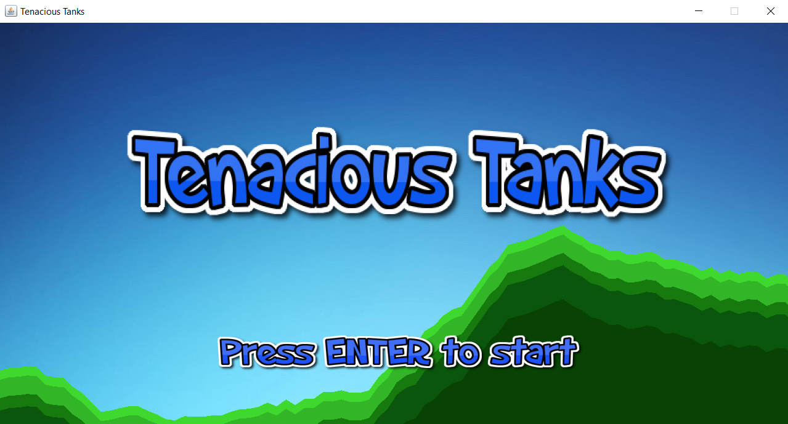
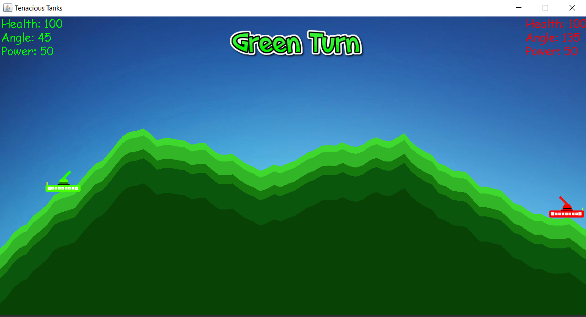

# Tenacious Tanks

A two-player tank game made using Java! ([Demo Video](https://youtu.be/iMbGX3d2MWY))

By [Cameron Beneteau](https://github.com/CameronBeneteau) and [Tailai Wang](https://github.com/tailaiwang)  
Course: Computer Science ICS4U (Grade 11)  
Date: February 16th, 2018  
Grade: 100%

  

<!-- Demo GIF here -->

## Table of Contents
[1. Intro](#Intro)  
[2. Gameplay](#Gameplay)  
[3. Environment Setup](#Environment-Setup)  
[4. How to Play](#How-to-Play)  
[5. Results](#Results)  
[6. Next Steps](#Next-Steps)  
[7. Development Changelog](#Development-Changelog)

## Intro

Tenacious tanks is a two-player turn-based strategy game inspired by the classic arcade game [Scorched Earth](https://en.wikipedia.org/wiki/Scorched_Earth_(video_game)).

This game was made using Java. It utilizes object-oriented programming and other ICS4U computing techniques.

## Gameplay

Check out the demo video for this project [here](https://youtu.be/iMbGX3d2MWY)!

  

## Environment Setup

To successfully run this project, please follow these steps to set up your environment:

1. Any IDE that runs Java (we recommend [IntelliJ IDEA](https://www.jetbrains.com/idea/), [JCreator](https://www.deepcrazyworld.com/how-to-download-jcreator-pro/) or [VS Code](https://code.visualstudio.com/download))
2. Java SE 8 (which includes JDK 1.8.0_333) ([Download from Oracle](https://www.oracle.com/java/technologies/javase/javase8u211-later-archive-downloads.html))
3. Ensure your IDE is configured to use the above version of Java SE and JDK

## How to Play

All instructions can be found in the game after pressing space bar on the main screen.

Run the [TenaciousTanks.java](TenaciousTanks.java) file to play!

## Results

All-in-all, the project was a great success! We had an enjoyable time developing this game while learning Java and object-oriented programming.

Even better: Our classmates and teachers had a great time fighting on the battlefield for ultimate bragging rights!

**Grade: 100%**

## Next Steps
Some fun things we would like to build on or explore relating to this project would be:

- Ability for players to customize their tank
- Ability for players to choose different map themes
- Display previous shot trajectory and info to help users make their next shot more precise
- Controls icons next to power and angle text fields in case users forget their controls

## Development Changelog
January 22nd, 2018: The project begins

January 23rd, 2018: Cameron starts developing Bullet Class and Testing

January 24th, 2018: Tailai has PISKEL and PNG files created for basic 2-player movement.

January 25th, 2018: Tailai updated TenaciousTanks.java to test out KeyListener.

January 26th, 2018: Cameron has map generation with an added background JPG file.

January 27th, 2018: Cameron debugged map generation and integrated with TenaciousTanks.java.
Tanks now fall from the sky on initial startup.
Rescaled tank images can now sit on the terrain while moving and at rest.
Began tank object class (deals with health, damage, etc).

February 5th, 2018: Cameron finished angle and movement inputs from users.

February 6th, 2018: Cameron created the turning process. Each player has a selection phase and shooting phase.
Tailai created and implemented turn images for each user.

February 7th, 2018: Cameron finished the movement restriction for tanks. (Can only move up to 50 pixels left or right during the selection phase)

February 8th, 2018: Cameron started bullet class.  
Bullets now fly using power, angle, and positions given by users.  
Bullets are affected by "gravity" and end turn when it collides with ground and tank rectangles.

February 9th, 2018: Tailai made an Update to GamePanel and TenaciousTanks. The game now has text displays and damage is calculated with collisions.  
Cameron created power for bullets. Users can now select a power between 0 and 100.

February 12th, 2018: Tailai made an Update to all files, allowing players to actually win the game. No Play Again button yet though...

February 16th, 2018: Cameron created the menu and instruction screens. Players can now go through the menu and instructions before starting the game. When the game finishes, players can choose to play again (all variables will reset) or exit the window.  
Tailai and Cameron added explosion sprites for bullet impacts. Added a new Python 3.2 file that splits sprites into png. files. Added explosion animation and polished up User Interface. Comments added to code.

February 16th, 2018: Project finished.
